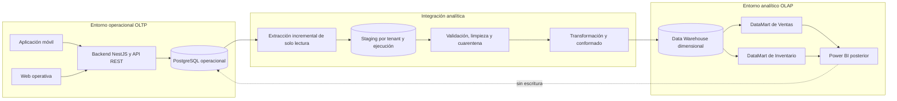

# Arquitectura de Business Intelligence

## Decisión arquitectónica

BodegIA separa el sistema operacional OLTP del sistema analítico OLAP. PostgreSQL operacional es la
fuente autoritativa de transacciones. El área de staging, el Data Warehouse dimensional, los
DataMarts y Power BI no sustituyen ni modifican directamente esa fuente.

## Sistema operacional OLTP

La aplicación móvil y la plataforma web operativa consumen el backend NestJS. El backend valida
tenant, autorización y reglas de negocio, y registra en PostgreSQL ventas, compras o recepciones,
inventario, lotes, clientes, proveedores, mermas, transformaciones y auditorías. El procesamiento TPS
y OLTP prioriza atomicidad, consistencia y respuesta operativa.

## Sistema analítico OLAP

1. **Extracción:** lee cambios autorizados desde PostgreSQL operacional mediante un mecanismo todavía
   por seleccionar.
2. **Staging:** recibe una copia temporal y trazable, separada por tenant y ejecución.
3. **Transformación y validación:** normaliza, integra, deriva medidas y aplica calidad.
4. **Data Warehouse dimensional:** conserva hechos, dimensiones e historia analítica.
5. **DataMarts integrados:** Ventas e Inventario comparten dimensiones conformadas.
6. **OLAP y consumo:** Power BI consulta modelos analíticos autorizados y genera dashboards posteriores.

## Diagrama de arquitectura

La relación discontinua representa una prohibición: Power BI no escribe ni corrige el OLTP.

## Flujo y responsabilidades

- La extracción minimiza impacto sobre el OLTP y registra punto de corte.
- Staging conserva origen, tenant, ejecución y estado de validación.
- Los registros inválidos se rechazan o aíslan; no se corrigen silenciosamente en la fuente.
- El Data Warehouse recibe solo datos válidos o tratados según reglas aprobadas.
- DataMart de Ventas organiza detalles de venta, importes, costos y márgenes.
- DataMart de Inventario organiza movimientos, stock, vencimientos y mermas.
- Power BI usa conexiones de solo lectura al entorno analítico.

## Frecuencia inicial

Se propone una actualización incremental programada diaria como hipótesis inicial académica, con
ejecución manual controlada para validación. No es una decisión definitiva: volumen, conectividad,
ventana operativa, costo y necesidad de frescura deben medirse antes de aprobar frecuencia y horario.

## Seguridad y aislamiento por tenant

- Cada registro analítico conserva la bodega o tenant correspondiente.
- Hechos, dimensiones, staging, cuarentena, auditoría ETL y modelos de consumo preservan ese límite.
- La autorización del consumo analítico se resuelve en el backend o mecanismo analítico aprobado,
  nunca solo por un filtro visual.
- Una bodega no puede consultar datos de otra ni inferir comparaciones cruzadas.
- DimBodega es conformada, pero su uso no autoriza consolidación pública entre tenants.

## Historia analítica

Los hechos se conservan como eventos históricos. Los cambios descriptivos relevantes pueden usar
dimensiones lentamente cambiantes; la política SCD final se definirá por atributo. Las correcciones
del OLTP llegan mediante nuevas extracciones o eventos compensatorios, no por edición desde BI.

## Separación de ambientes

- **Desarrollo:** datos sintéticos o anonimizados y credenciales exclusivas.
- **Pruebas:** conjuntos controlados para calidad, aislamiento, carga y regresión.
- **Producción:** datos reales, mínimo privilegio, monitoreo y aprobación humana aplicable.

Staging, Data Warehouse, DataMarts, conexiones y credenciales se separan por ambiente. Ninguna prueba
se ejecuta contra la base productiva real.

## Decisiones pendientes

Herramienta ETL, almacenamiento físico analítico, mecanismo de captura incremental, frecuencia final,
ventana de carga, estrategia SCD por dimensión, recuperación ante fallos, objetivos de rendimiento y
mecanismo exacto de seguridad de Power BI.
