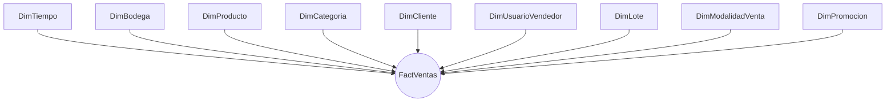
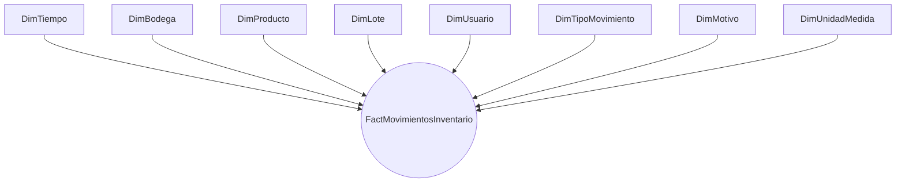

# Modelo dimensional preliminar

## Carácter del diseño

Este modelo aplica Kimball de forma conceptual. No define tablas físicas, columnas definitivas,
tipos SQL, índices ni migraciones. Nombres, fórmulas y estrategias históricas deben validarse antes
de una especificación implementable.

## Conceptos

- **Tabla de hechos:** conjunto de eventos medibles a un grano declarado, como un detalle de venta o
  un movimiento de inventario.
- **Dimensión:** contexto descriptivo para analizar hechos, como tiempo, producto, bodega o modalidad.
- **Medida:** valor cuantitativo agregable o interpretable, como importe neto o merma.
- **Grano:** significado exacto de una fila; se declara antes de dimensiones y medidas.
- **Dimensión conformada:** dimensión con significado y claves compatibles entre DataMarts.
- **Esquema estrella:** hechos centrales relacionados directamente con dimensiones desnormalizadas
  orientadas a consulta.
- **Copo de nieve:** normaliza jerarquías dimensionales en más relaciones; puede reducir redundancia,
  pero aumenta complejidad de consulta.

## Kimball e Inmon

Kimball construye iterativamente DataMarts dimensionales integrados por dimensiones conformadas.
Inmon prioriza un almacén corporativo integrado, normalmente normalizado, del cual se derivan
DataMarts. BodegIA selecciona Kimball porque el alcance académico comienza con dos procesos claros
—ventas e inventario—, necesita entregas incrementales y puede integrarlos mediante tiempo, bodega,
producto y lote sin anticipar un almacén empresarial completo.

## DataMart de Ventas

### FactVentas

**Grano:** una fila por producto, modalidad de venta y lote consumido dentro del detalle de una venta.
Si un detalle consume varios lotes, se representa una fila por lote y los importes compartidos se
asignan mediante una regla trazable todavía por validar.

**Medidas preliminares:**

- Cantidad vendida: unidad o peso realmente registrado; ausente para venta por importe no medida.
- Importe bruto.
- Descuento.
- Importe neto.
- Costo atribuido.
- Margen bruto.
- Utilidad: medida preliminar; no se igualará automáticamente al margen bruto si posteriormente se
  incorporan otros costos autorizados.
- Indicador de margen estimado o definitivo.

**Dimensiones preliminares:** DimTiempo, DimBodega, DimProducto, DimCategoria, DimCliente,
DimUsuarioVendedor, DimLote, DimModalidadVenta y DimPromocion.

### Esquema estrella preliminar de ventas

DimPromocion debe admitir un miembro «Sin promoción»; no se presume que toda venta tenga promoción.

## DataMart de Inventario

### FactMovimientosInventario

**Grano:** una fila por movimiento de inventario, producto, lote y momento. Un movimiento que afecte
varios lotes se separa respetando ese grano.

**Medidas preliminares:**

- Cantidad de entrada.
- Cantidad de salida.
- Cantidad de merma.
- Costo del movimiento.
- Stock anterior.
- Stock posterior.
- Importe asociado.

Para lotes no medidos, las cantidades físicas y stocks exactos permanecen ausentes; el estado
aproximado puede analizarse como atributo o evento cualitativo, nunca como cantidad imputada.

**Dimensiones preliminares:** DimTiempo, DimBodega, DimProducto, DimLote, DimUsuario,
DimTipoMovimiento, DimMotivo y DimUnidadMedida.

### Esquema estrella preliminar de inventario

## Matriz bus

| Proceso / DataMart | Tiempo | Bodega | Producto | Categoría | Cliente | Usuario | Lote | Modalidad de venta | Promoción | Tipo de movimiento | Motivo | Unidad de medida |
| ------------------ | ------ | ------ | -------- | --------- | ------- | ------- | ---- | ------------------ | --------- | ------------------ | ------ | ---------------- |
| Ventas             | X      | X      | X        | X         | X       | X       | X    | X                  | X         |                    |        |                  |
| Inventario         | X      | X      | X        |           |         | X       | X    |                    |           | X                  | X      | X                |

## Dimensiones conformadas

- **DimTiempo:** calendario común y periodos aprobados.
- **DimBodega:** tenant común; siempre participa en seguridad y aislamiento.
- **DimProducto:** identidad y presentación compatibles entre ventas e inventario.
- **DimLote:** lote común para costo, vencimiento, margen y movimientos.
- **DimUsuario:** concepto conformado; FactVentas puede exponer el rol vendedor mediante una vista
  lógica o dimensión de rol compatible.

DimCategoria puede conformarse posteriormente si Inventario requiere análisis directo por categoría.

## Dimensiones lentamente cambiantes

- **Tipo 1:** corrige atributos sin conservar versión; solo para errores sin valor histórico y con
  autorización.
- **Tipo 2:** crea una versión con vigencia para conservar cómo se conocía el atributo al ocurrir el
  hecho.
- **Tipo 0:** mantiene atributos inmutables.

La selección se valida atributo por atributo. Precio, categoría, nombre comercial y configuración no
deben sobrescribirse históricamente por defecto sin evaluar el significado analítico.

## Casos especiales

### Cliente general

DimCliente contiene un miembro especial «Cliente general», sin datos personales. Sus ventas se
incluyen en totales de ventas, pero se excluyen de clientes frecuentes, fidelización y análisis
individual.

### Venta por importe sin cantidad medida

Cantidad vendida permanece ausente y no se imputa. Importe bruto/neto e ingreso acumulado son exactos.
El costo y margen pueden permanecer estimados mientras el lote esté abierto y convertirse en
definitivos al cierre. El indicador de estado evita mezclar ambas condiciones.

### Producto vendido por peso y unidad

DimModalidadVenta distingue la modalidad de cada hecho. La cantidad conserva su unidad real. Una
equivalencia estimada del lote puede almacenarse como contexto trazable, pero no sustituye la medida
real ni se agrega como si fuera exacta.

### Margen estimado y definitivo

Un mismo lote puede generar hechos de venta mientras su margen permanece estimado. El cierre del lote
habilita el cálculo definitivo mediante proceso trazable. La estrategia para actualizar, versionar o
publicar esa reclasificación sin perder historia queda pendiente de diseño ETL.

## Salvaguardas

Cada hecho y dimensión dependiente conserva tenant. Las claves desconocidas se gestionan sin cruzar
bodegas. Los DataMarts no modifican OLTP y Power BI no accede a datos de tenants no autorizados.
